<!-- Hero: ASCII portrait (types in row by row) beside the extruded 3D
     "AR" monogram (wipes in, then rocks on its vertical axis).
     Widths are chosen so the pair spans the same 735px as the calendar.
       portrait: make photo   (or: python scripts/make_ascii_svg.py)
       monogram: python scripts/make_wordmark_svg.py --text AR
     Everything here is a self-hosted SVG -- no badge services, nothing
     that can rate-limit. How it works: docs/how-it-works.md -->

<h3><code>abdul@github ~ $ whoami</code></h3>

<table>
<tr>
<td valign="top"></td>
<td valign="top"></td>
</tr>
</table>

 

 
 

<!-- Real calendar data, re-scraped and committed daily by
     .github/workflows/update-profile-art.yml -->

<h3><code>abdul@github ~ $ ./contributions.sh</code></h3>

 
 

<h3><code>abdul@github ~ $ ./links.sh</code></h3>

<b>Backend Developer</b> · Python · Django/DRF · FastAPI · PostgreSQL

 

## `~ $ ls -l ./work`

| Project | What it is | Built with |
| --- | --- | --- |
| **[the-portfolio](https://github.com/abdul-rehman174/the-portfolio)** | Personal portfolio, live at [madebyabdul.me](https://madebyabdul.me) | CSS · HTML · JS |
| **[trackforge_enterprise](https://github.com/abdul-rehman174/trackforge_enterprise)** | ERP system — the main thing I'm building right now | Django 5 · DRF |
| **[smart-reply-assistant](https://github.com/abdul-rehman174/smart-reply-assistant)** | Paste a message, pick a tone, get replies in your own language. Bring your own free Groq key | HTML · JS · Groq |
| **[employee-management-system](https://github.com/abdul-rehman174/employee-management-system)** | CLI employee management — OOP, role-based access, CSV-driven | Python |
| **[ai-excuse-generator](https://github.com/abdul-rehman174/ai-excuse-generator)** | Type or speak a situation, get tailored excuses in your language | HTML · JS · Groq |
| **[python-mini-projects](https://github.com/abdul-rehman174/python-mini-projects)** | Games, calculators, utilities and OOP exercises, collected | Python |

## `~ $ cat ./about`

Backend developer at Enigmatix Software House in Bahawalpur, finishing a BS in
Software Engineering at IUB in 2027. I spend most of my time on Django and
FastAPI services — REST API design, ORM query shapes that don't fall over at
scale, and Postgres schemas for multi-tenant systems.

Currently working through FastAPI's internals and the DevOps side of shipping:
containers, CI, and what it actually takes to keep a service up.

Happy to talk about API design, Django ORM, or Postgres modelling — the contact
badge above reaches me.

 

Every graphic above is generated from my own data by the scripts in
<a href="./scripts"><code>scripts/</code></a> — no third-party badge services.
The calendar refreshes itself daily.
<a href="./docs/how-it-works.md">How it works →</a>

